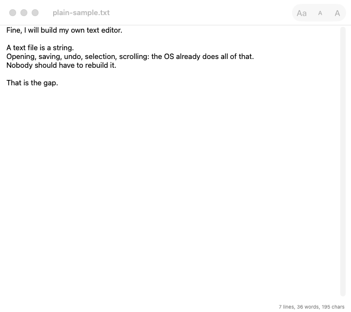
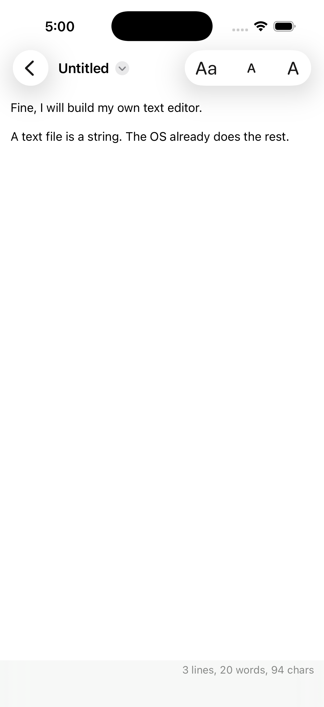

# plain

  [](https://github.com/nulljosh/plain)

They don't make them like Sublime Text anymore. Editors are a div soup, a browser in a trench coat, or a subscription.

A text file is a string. Opening, saving, undo, selection, scrolling, accessibility: the OS already does all of that better than any JavaScript will. Nobody should have to rebuild it.

That's the gap.

Live at [plain.heyitsmejosh.com](https://plain.heyitsmejosh.com).

<p> </p>

## What it does

Plain opens a text file, a Markdown file, or a source file and lets you type. No preview, no highlighting: the file is a string and stays one. Mac and iPhone and iPad, one codebase. Autosave, versions, iCloud, Open Recent, tabs, undo and redo all come from the system. The app adds a monospaced toggle, a font size, and a line/word/character count in the corner.

The command line side opens a file in the app or counts it.

```
plain notes.txt          open in Plain (.txt, .md, any code)
plain stat notes.txt     3 lines, 12 words, 71 chars
cat x | plain stat       counts from stdin
```

## Why this and not Monaco

David Bushell tried canvas, then contenteditable, then a textarea, and landed on the same lesson: the native thing wins. This is that lesson taken all the way. No web view, no rendering layer, no cursor drawn by hand.

## Run it

```
cd ios && xcodegen generate && open Plain.xcodeproj
swiftc -O -o plain ios/App/Stats.swift cli/main.swift      # the CLI
swiftc -o /tmp/c ios/App/Stats.swift ios/Checks/main.swift && /tmp/c   # self-check
```
